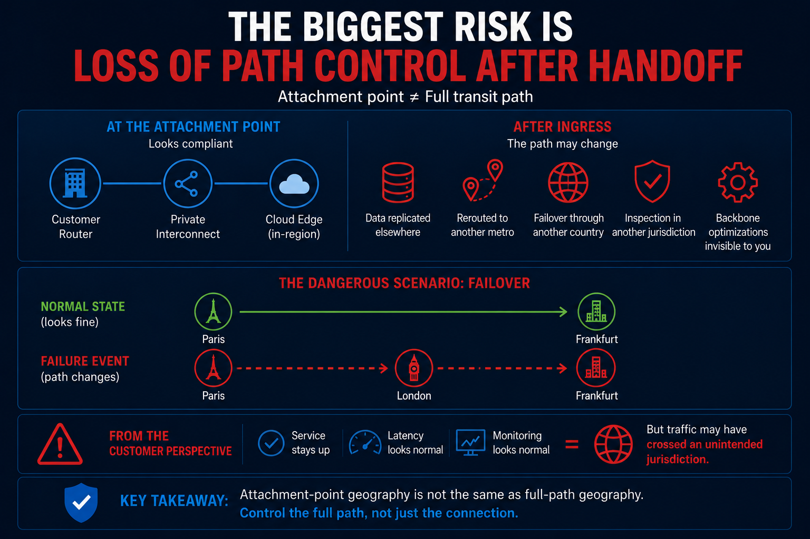
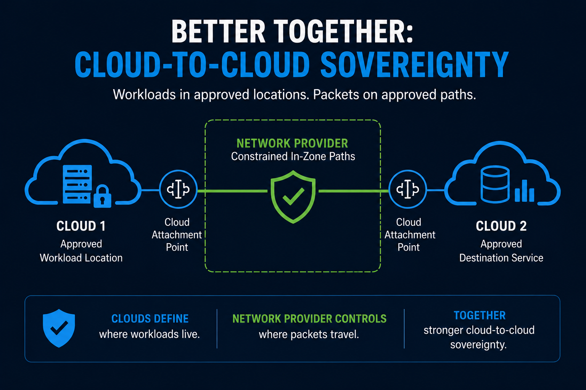

Choosing the right cloud region is often treated like the end of the conversation.

For many teams, it is really the beginning.

When people talk about data residency, they are usually talking about where workloads are deployed, where storage sits, and which geography is associated with the service configuration.

Those are important questions.

They are just not the only questions anymore.

If the claim is "our data remains in the EU" or "customer traffic stays in-country," that statement carries a meaning that goes beyond storage.

- It suggests something about transit.
- It suggests something about jurisdiction.
- It implies some degree of control over the path data took between endpoints.

That is where the problem starts.

Data residency is mostly a storage and placement answer.

Data in transit is a network answer.

Those are related, but they are not interchangeable.

A workload can be deployed in the right geography and still depend on network paths that are difficult to explain, verify, or defend. Traffic can cross geographic boundaries or move across backbones optimized for resilience and performance rather than sovereignty.

Customers, auditors, and regulators increasingly want more than a deployment region. They want to understand what assurances exist for the whole data plane, including movement in transit.

Teams know how to say:

- "The database is hosted in-region."
- "Backups are confined to approved geographies."
- "The control plane has a regional option."

They are much less consistent when the question becomes:

- "What path did traffic take?"
- "Which jurisdictions did it traverse?"
- "What evidence supports that assertion?"
- "How much of that answer is design intent versus observed proof?"

This is why the phrase "data sovereignty" gets muddy so fast.

A simpler framing is more useful:

- **Data residency is a storage answer**

- **Data in transit is a path answer**

Data sovereignty is broader than both, because it includes who had control, which legal domains applied, and whether the evidence behind the claim is strong enough to stand up under scrutiny.

## Endpoint Geography And Path Geography Are Different Problems

This is the technical distinction underneath the broader argument.

Endpoint geography asks:

**Where is the application, database, service, or storage instance located?**

That is usually the easier question.

It can often be answered with deployment configuration, region settings, infrastructure inventory, or provider documentation.

Path geography asks something harder:

**Where did the traffic actually travel between source and destination?**

That question gets messy fast.

Even in architectures that appear geographically compliant at the application or cloud layer, the actual transit path can still be shaped by:

- provider-controlled backbone routing
- automatic failover behavior
- traffic-engineering policies optimized for performance or resiliency
- inter-provider and carrier handoffs
- dynamic congestion management
- limited customer visibility into internal path decisions

That is why endpoint geography and path geography are not interchangeable.

Endpoint geography is often about inventory.

Path geography is about observation and proof.

They require different tools and different levels of confidence.

That is the core reason a region selection is not the same thing as a sovereignty proof statement.

There is a meaningful difference between these two claims:

- "We configured the workload to reside in an approved geography."
- "We can prove the relevant traffic remained inside an approved geography."

The first may be true.

The second requires a much higher bar.

It requires clarity about what portion of the path is actually controlled, what portion a provider controls, and what portion can only be inferred.

That distinction is not just technical hygiene.

It is credibility.

## The Biggest Risk Is Loss Of Path Control After Handoff

The attachment point is not the same thing as the full transit path.

A connection can look geographically constrained at ingress and still become much broader after traffic leaves that first edge.

A simple path such as:

Customer router -> private interconnection -> cloud edge in Frankfurt

can look sovereign on paper.

But after ingress:

- the cloud provider may replicate data elsewhere
- route across another metro
- fail over through another country
- centralize inspection in a different jurisdiction
- or use internal backbone optimizations invisible to the customer

The most operationally dangerous scenario is failover.

Normal state:

Paris -> Frankfurt

Failure event:

Paris -> London -> Frankfurt

From the customer perspective, the service can remain healthy.

The connection can stay up.

Latency may barely change.

Monitoring may still look normal.

Geographically, however, the traffic may have crossed an unintended jurisdiction.

That is why attachment-point geography should not be confused with full-path geography.

## What A Stronger Solution Starts To Look Like

A more credible approach is to enforce geography inside a provider-controlled backbone instead of treating geography as a best-effort outcome.

A provider can do that by creating geographically constrained forwarding domains that keep customer traffic inside defined sovereign or regulatory boundaries.

The core idea is not just where the workload lives.

It is where packets are actually allowed to travel while in transit across the provider network.

In that model:

- the provider backbone has explicit geography-aware path policies
- infrastructure and transport segments are classified according to sovereign or regulatory boundaries
- routing decisions are calculated against those geography constraints inside the control plane
- traffic associated with a specific sovereign policy is only allowed to use paths that satisfy that geography's rules

That allows isolated routing domains such as:

- United States only
- Canada only
- European Union only

Take a simple example.

A customer purchases a sovereign connection confined to the United States.

The network then:

- assigns that service to a US-specific path policy
- restricts valid paths to links and nodes eligible for US-only transport
- prevents traffic from traversing international transit links
- drops traffic if no compliant path exists

So even if a lower-latency or operationally preferred route exists through another country, the control plane does not consider it valid for that customer's traffic.

The same idea applies to an EU regional zone:

- traffic may traverse multiple EU member states
- but cannot exit the defined EU geography
- paths crossing non-EU countries are excluded from path computation

This is different from traditional cloud routing because:

- cloud paths are largely provider-optimized and opaque
- policy-constrained backbone routing allows deterministic in-zone forwarding
- the provider explicitly controls which backbone segments are eligible

## Better Together: Cloud-To-Cloud Sovereignty

This is also where a cloud-to-cloud model becomes more interesting.

Consider a regulated workload running in one approved cloud region that needs to exchange data with an application, analytics platform, or recovery service running in another approved cloud region within the same sovereign zone.

If those two clouds are connected through ordinary opaque transit, the workload placement may be compliant while the path between them remains difficult to explain.

A stronger model is to use a private network provider between the two cloud attachment points and apply in-zone path controls across that provider-controlled segment.

In that model:

- one cloud provides the approved workload location
- the second cloud provides the approved destination service
- the network provider provides the constrained transit domain between them

That is the better-together answer.

The clouds help answer where the workloads live.

The network provider helps constrain where the packets are allowed to travel between them.

It still does not solve every sovereignty question by itself.

But it creates a much stronger architecture for cloud-to-cloud sovereignty than simply assuming two in-region deployments automatically imply an in-region path.

## Why This Matters

This kind of architecture has real compliance value.

It helps reduce the risk of unintended cross-border transit.

It provides stronger architectural assurance that traffic remains within the selected zone.

It is especially relevant for government, healthcare, finance, and critical infrastructure environments.

The claim is architectural, not absolute:

**"Customer traffic is constrained to provider-controlled backbone paths that are algorithmically restricted to infrastructure located entirely within the selected sovereign geography."**

That is a much stronger answer than a region label alone.
